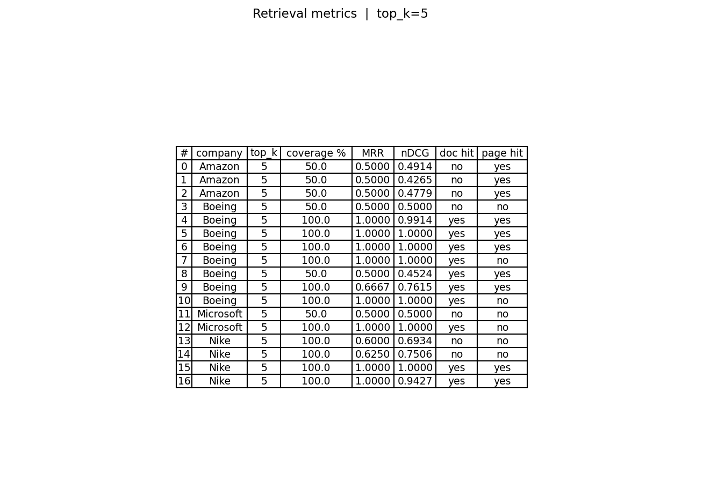
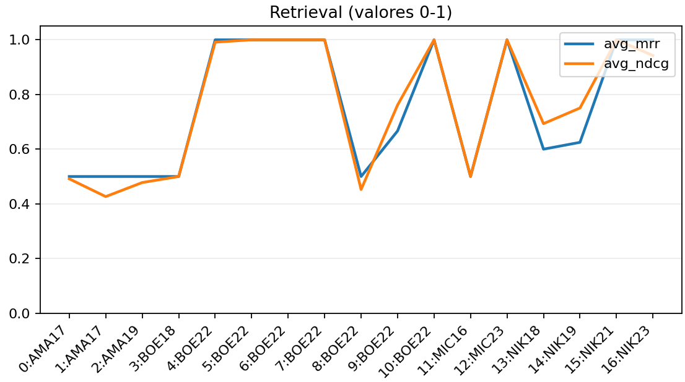

# Financial Q&A Agent — RAG sobre Relatórios Financeiros

Esse repositório foi desenvolvido como case técnico para processo Seletivo da **MadeInWeb**.

Consiste na construção de um agente conversacional de Q&A financeiro construído sobre um pipeline de
Retrieval-Augmented Generation (RAG). Com enfoque em analisar documentos reais
de empresas listadas em bolsa (10-K, 10-Q, earnings reports) mantendo contexto
ao longo de múltiplos turnos de conversa.

Consideração importante:
Os modelos de LLM e embedding, foram escolhidos visando o melhor tradeoff de performance e qualidade baseado na minha configuração atual que consiste:

### Especificações
Intel Core i5-10400F | NVIDIA GA106 RTX 3060 12GB | 16 GB RAM

---

## Sumário


1. Stack e dependências
2. Estrutura do repositório
3. Instalação
4. Dataset
5. Pipeline de ingestão
6. Retriever
7. Agente e gerenciamento de memória
8. Interface
9. Avaliação
10. Demonstração
12. Melhorias futuras


---

## Stack e dependências

| Componente | Escolha | Motivo |
|---|---|---|
| LLM | `qwen2.5:7b` via Ollama | Roda localmente, sem custo de API, bom custo-benefício para texto financeiro em inglês |
| Embeddings | `qwen3-embedding:4b` via Ollama | Modelo de embedding dedicado, mesma família do LLM, sem dependência de API externa |
| Vector store | ChromaDB (persistido em disco) | Leve, sem servidor separado, suporta filtros por metadado |
| Orquestração | LangChain | Abstrações para retriever, histórico de mensagens e prompt templates |
| PDF loader | PyMuPDF | Extração fiel de texto e metadados de página em PDFs densos |
| Interface | Gradio | UI conversacional sem necessidade de frontend customizado |
| Avaliação | MRR, nDCG, keyword coverage, doc/page hit | Métricas padrão de Information Retrieval, sem dependência de LLM externo |

Todas as inferências rodam localmente via [Ollama](https://ollama.com). Nenhuma
chave de API é necessária para executar o projeto.
Para rodar o app localmente, basta instalar as dependências, com ambiente virtual ativado e diretório localizado na aplicação rode:

```
python agent.py
```

---

## Estrutura do repositório

```
.
├── data/
│   └── pdfs/                     # PDFs do FinanceBench 
├── evaluation/
│   ├── financebench_open_source.jsonl   # perguntas e gabaritos
│   ├── test.py                   # carrega e normaliza os testes
│   ├── eval.py                   # métricas de retrieval + export de imagem
│   └── results/                  # tabelas geradas pelo eval.py
├── memory/
│   └── long_term.json            # memória de longo prazo persistida
├── notebooks/
│   └── demonstracao_rag.ipynb    # Overview geral do case, exibição de funcionamento dos módulos principais (ingestor, retriever, agente e interface interativa)
│   └── future_improvements.ipynb # ideias para melhorias futuras
├── src/
│   ├── agent.py                  # agente conversacional + gerenciamento de memória
│   ├── ingestion.py              # ingestão de PDFs → ChromaDB
│   ├── interface.py              # UI Gradio
│   └── retriever.py              # FinancialRetriever (ChromaDB + Ollama)
├── vector_store/                 # ChromaDB persistido (não versionado)
└── README.md
```

---

## Instalação

**Pré-requisitos:** Python 3.11+, [Ollama](https://ollama.com) instalado e rodando.

```bash
# 1. Clone o repositório
git clone <url-do-repo>
cd <repo>

# 2. Crie e ative o ambiente virtual
python -m venv .venv
source .venv/bin/activate      # Linux/macOS
# .venv\Scripts\activate       # Windows

# 3. Instale as dependências
pip install -r requirements.txt

# 4. Baixe os modelos Ollama
ollama pull qwen2.5:7b
ollama pull qwen3-embedding:4b

# 5. Confirme que o Ollama está rodando
ollama serve   # deixe rodando em outra aba, ou verifique se já está ativo
```

**`requirements.txt` mínimo:**

```
langchain==1.2.15
langchain-community==0.4.1
langchain-core==1.2.31
langchain-text-splitters==1.1.2
chromadb==1.5.8
PyMuPDF==1.27.2.3
gradio==6.13.0
matplotlib==3.10.8
pydantic==2.12.5
tqdm==4.67.3
jupyter==1.1.1
ipykernel==7.2.0

```
## Execução do Projeto

Para interagir com o agente financeiro, você pode optar por duas formas de execução, dependendo do nível de detalhamento desejado para a demonstração.

### 1. Demonstração Interativa via Jupyter Notebook 
Para visualizar o chatbot acompanhando o funcionamento modular de cada etapa do pipeline (Retriever, Memória e Avaliação), utilize o notebook de demonstração.
Com o ambiente virtual ativado e na raiz do repositório, execute o comando abaixo no terminal para abrir o Jupyter diretamente no arquivo correto:
```bash
jupyter notebook notebooks/demonstracao_rag.ipynb
```

### 2. Execução Direta via Terminal
Caso deseje apenas iniciar o chatbot com a interface Gradio sem as explicações detalhadas do notebook, execute o script principal do agente.
Com o ambiente virtual ativado e na raiz do repositório, utilize o comando:
```bash
python src/agent.py
```

---

## Dataset

O projeto usa o **FinanceBench**, benchmark público com ~150 perguntas anotadas
por especialistas, cobrindo empresas como Apple, Amazon, Boeing, Microsoft e Nike.

```bash
# Clone o repositório do FinanceBench e copie os PDFs
git clone https://github.com/patronus-ai/financebench
cp -r financebench/pdfs/ data/pdfs/
cp financebench/data/financebench_open_source.jsonl evaluation/
```

Para o projeto foram selecionados 5 pdfs principais, disponíveis do diretório data/pdfs do repositório:

| Arquivo | Empresa | Tipo | Período |
|---|---|---|---|
| `APPLE_2022_10K.pdf` | Apple | 10-K | FY2022 |
| `AMAZON_2023Q1_10Q.pdf` | Amazon | 10-Q | Q1 2023 |
| `BOEING_2022_10K.pdf` | Boeing | 10-K | FY2022 |
| `MICROSOFT_2022_10K.pdf` | Microsoft | 10-K | FY2022 |
| `NIKE_2023_10K.pdf` | Nike | 10-K | FY2023 |

---

## Pipeline de ingestão

```bash
python src/ingestion.py
```

O script lê todos os PDFs em `data/pdfs/`, aplica chunking e persiste os embeddings
no ChromaDB em `vector_store/`.

### Carregamento

Para o carregamento (doc loading) a escolha do `PyMuPDFLoader` se dá pela afinidade com extração de texto de PDFs. Como o objeto de análise são PDFs financeiros densos, incluindo tabelas multilinha, é necessário um loader recursivo que seja capaz de processar a informação corretamente.
Cada página vira um `Document` LangChain com
metadados enriquecidos extraídos do nome do arquivo:

```
APPLE_2022_10K.pdf  →  company=APPLE, year=2022, doc_type=10K
```

### Chunking

```python
CHUNK_SIZE    = 800   # caracteres
CHUNK_OVERLAP = 150   # ~20% de overlap
SEPARATORS    = ["\n\n", "\n", ". ", ", ", " ", ""]
```

**Por que 800 caracteres?** Buscamos conter uma unidade semântica completa (seja parágrafo ou tabela).
Geralmente documentos financeiros contém uma seção narrativa (300–500 chars) e tabelas de dados (600–900 chars).
Um chunk de 800 chars tende a conter essa unidade semântica sem (ou minimizando quebra).

Um valor maior como 1000 ou 2000, podem ainda abranger o conteúdo, porém, podem facilitar a perda de contexto pelo modelo.
Tais escolhas são verificadas e validadas metricamente na seção evaluation do repositório e nos notebooks de demonstração.

**Por que 20% de overlap?** Valores financeiros frequentemente aparecem em contexto
imediato da frase anterior ("Net income increased 12% to **$X billion**..."). O
overlap garante que esse contexto não seja perdido na fronteira entre chunks.


### Embeddings e armazenamento

Embeddings são gerados em batches de 20 via `qwen3-embedding:4b` e persistidos no
ChromaDB com `upsert`. Se a ingestão for interrompida e reexecutada com
`RESET_INDEX=0`, os chunks já existentes são pulados sem recalcular embeddings.

---

## Retriever

`src/retriever.py` implementa um `BaseRetriever` LangChain que conecta ao ChromaDB
e aplica filtro por empresa quando detectada na query.

### Detecção de empresa

```python
KNOWN_COMPANIES = ["APPLE", "AMAZON", "BOEING", "MICROSOFT", "NIKE"]
```

Um regex simples sobre a query identifica a empresa mencionada. Se encontrada, o
ChromaDB recebe um filtro `where={"company": "APPLE"}`, restringindo a busca aos
documentos daquela empresa. Isso reduz ruído de recuperação em casos
práticos (perguntas sobre uma empresa específica).

Se nenhuma empresa for detectada, a busca roda sem filtro sobre toda a coleção.

### Busca por similaridade

O vetor da query é comparado contra os embeddings armazenados usando distância
cosseno. Os `N_RESULTS=5` chunks mais próximos são retornados com seu
`similarity_score = 1 - distance`.

---

## Agente e gerenciamento de memória

`src/agent.py` orquestra o pipeline completo: memória → reescrita de query →
retrieval → geração de resposta.

### Arquitetura de memória em três camadas

O agente implementa três camadas de memória para suportar conversas multi-turn
longas sem extrapolar o contexto do LLM:

**Curto prazo** — `InMemoryChatMessageHistory` (LangChain)

As últimas `SHORT_TERM_K=6` trocas (12 mensagens) são mantidas in-memory e
injetadas no prompt a cada turno. Quando o limite é ultrapassado, as mensagens mais
antigas são descartadas.

**Médio prazo** — Sumarização periódica

A cada `SHORT_TERM_K` turnos, o LLM é chamado para sumarizar a conversa acumulada
em 3–5 frases focadas em empresas, figuras e conclusões relevantes. O resumo é
injetado no campo `session_summary` do prompt. Isso preserva o fio da conversa sem
acumular tokens indefinidamente.

**Longo prazo** — `memory/long_term.json`

Ao fim de cada sessão, o resumo da sessão é persistido em JSON com timestamp. Nas
sessões seguintes, os últimos `MAX_PAST_SUMMARIES=3` resumos são carregados e
incluídos no prompt, dando ao agente contexto sobre o que foi discutido antes.


### Reescrita de queries anafóricas

Perguntas de follow-up como "And how does that compare to the previous year?"
contêm referências anafóricas ("that") que o retriever não consegue resolver
isoladamente, o que acarreta no modelo de embedding não recuperando os chunks corretos.

Quando detectada uma referência anafórica via regex (`this`, `it`, `that`, `isso`,
etc.), o LLM é chamado com o histórico para reescrever a pergunta como uma query
autocontida e então, passar para o retriever.

```
"And how does that compare to the previous year?"
→ "How does Apple's FY2022 net income compare to FY2021?"
```

Se o LLM falhar, a pergunta original é usada como fallback

---

## 9. Interface

```bash
python src/agent.py

```

A interface Gradio (`src/interface.py`) exibe o agente com:

- Chat multi-turn com histórico
- Botão "Clear session" — reseta memória de curto e médio prazo
- Botão "Show memory" — exibe relatório da memória atual
- Painel lateral com estado da sessão (turnos, última sessão, resumos)
- Exemplos pré-carregados com as perguntas do case

---

## Avaliação

```bash
# Avaliar os primeiros 10 testes, salvar tabela PNG
python evaluation/eval.py --max 10 --k 5 --plot-file evaluation/results/k5.png

# Comparar com top_k diferente
python evaluation/eval.py --max 10 --k 10 --plot-file evaluation/results/k10.png
```

### Métricas de retrieval

A avaliação não usa LLM externo, ou seja, todas as métricas são calculadas diretamente
sobre os chunks recuperados, sem custo de API.

**Keyword Coverage**

Percentual de keywords esperadas (nome da empresa + ano fiscal) encontradas em
pelo menos um dos chunks recuperados:

```
coverage = keywords_found / total_keywords × 100
```

É a métrica mais direta: se o chunk certo foi recuperado, as keywords estarão lá.

**MRR — Mean Reciprocal Rank**

Mede em qual posição a keyword aparece pela primeira vez nos resultados. Penaliza
sistemas que encontram a resposta, mas só em posições baixas do ranking:

```
RR(q) = 1 / rank_primeira_ocorrência
MRR   = média dos RR sobre todas as keywords
```

MRR = 1.0 significa que todas as keywords aparecem no primeiro chunk retornado, o que configura uma 
situação ideal. MRR = 0.5 significa que em média estão na segunda posição.

**nDCG — Normalized Discounted Cumulative Gain**

Avalia a qualidade da ordenação dos resultados com desconto logarítmico por
posição. Um chunk relevante na posição 1 contribui mais do que na posição 5:

```
DCG  = Σ (2^rel_i - 1) / log2(i + 1)
nDCG = DCG / IDCG        (IDCG = DCG ideal, relevantes primeiro)
```

Para relevância binária (keyword presente/ausente), nDCG = 1.0 significa que
todos os chunks relevantes estão no topo do ranking.

**Doc Hit / Page Hit**

Verificação direta de metadados: o arquivo de origem (`doc_name`) e a página de
evidência anotada no FinanceBench aparecem nos metadados dos chunks recuperados.
São sinais de que o retriever foi ao documento certo, não apenas a chunks
semanticamente próximos.

### Por que essas métricas?

MRR e nDCG são complementares: MRR foca em "o chunk certo aparece cedo?", nDCG
foca em "a ordenação geral é boa?". Coverage responde "encontramos alguma coisa?"
e os hits de doc/página respondem "fomos ao lugar certo?".

Pensando em cobrir os erros mais comuns em RAG financeiro: recuperar chunks do arquivo
errado, recuperar o arquivo certo mas a página errada, e recuperar contexto
semanticamente próximo mas factualmente irrelevante foram escolhidas como métricas principais.

### Saída

Cada execução imprime um JSON por teste no stdout e salva uma tabela PNG em
`evaluation/results/` com as colunas: `#`, `company`, `top_k`, `coverage %`,
`MRR`, `nDCG`, `doc hit`, `page hit`. A imagem é o artefato de comparação entre
experimentos com diferentes configurações de chunking ou `top_k`.



Resultados comparativos entre métricas:



Nos primeiros 16 testes do benchmark com `k=5`, o retriever atingiu os seguintes resultados:

| Configuração | Coverage % | MRR | nDCG | Doc Hit | Page Hit |
|---|---|---|---|---|---|
| top_k = 5 | 100% | 0.91 | 0.77 | 100% | 70% |
| top_k = 10 | 100% | 0.80 | 0.76 | 100% | 80% |

Coverage e MRR perfeitos indicam que as keywords de empresa e ano fiscal aparecem consistentemente no primeiro chunk retornado. O page hit abaixo de 100% reflete casos onde a evidência está distribuída em páginas adjacentes. Uma possível conclusão é que o retriever chega ao documento certo, mas nem sempre à página exata anotada no gabarito. Em nosso contexto isso se da por eventos multifatoriais como a query mencionar um contexto que não existe na base (Datas, métricas).

---

## Demonstração

Perguntas do case com respostas esperadas (disponíveis com gabarito no FinanceBench):
Esse é um snippet do funcionamento, a demonstração completa se encontra no diretório **notebooks**


```
User:  What is Apple's FY2022 net income?
Agent: Apple's net income for FY2022 was $99.8 million, as reported in their
       annual 10-K filing for the fiscal year ended September 24, 2022.
```

**Follow-up com referência anafórica:**
```
User:  And how does that compare to the previous year?
       [reescrito internamente para: "How does Apple's FY2022 net income
        compare to FY2021?"]
Agent: Apple's FY2021 net income was $94.7 million. The FY2022 figure of $99.8
       million represents an increase of approximately 5.4% year-over-year.
```

**Pergunta multi-empresa:**
```
User:  What was Amazon's revenue in Q1 2022?
Agent: The provided context does not contain specific revenue data for Q1 2022. The financial information given covers the fiscal year ended December 31, 2022. For precise Q1 2022 revenue, we would need to refer to Amazon's Form 10-Q report for that period or another relevant earnings release.

If you are interested in the overall annual figures for 2022, here is a summary:

    Net Sales: $513,983 million (for the year ended December 31, 2022)
    AWS Revenue: $80,096 million (for the year ended December 31, 2022)

For more detailed quarterly information, please specify which company and exact period you are interested in.
```

**Pergunta qualitativa:**
```
User:  What are the main risk factors cited by Boeing in their most recent 10-K?
Agent: Boeing's most recent 10-K cites the following primary risk factors:
       - Supply chain disruptions and availability of key raw materials
       - Regulatory scrutiny following the 737 MAX incidents
       - Dependency on government defense contracts
       - Exposure to macroeconomic conditions affecting commercial aviation demand
       - Cybersecurity threats to operational and customer data
```

---

## Melhorias futuras

Ver `notebooks/future_improvements.ipynb` para uma discussão sobre possível implementaçao:

- **Reranking:** aplicar um cross-encoder sobre os chunks recuperados para
  reordenar por relevância semântica real
- **LLM-as-a-judge:** usar um modelo externo (geralmente mais leve) para avaliar, já que o output pode ser tratado como binário (válido ou não válido)
  accuracy, completeness e relevance das respostas
- **LLM-Chunk-Splitter** uso de uma LLM menor para otimizar o processo de chunking
